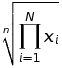
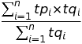

# Super Simple Stocks

##Index
* [Problem Statement](#problem-statement)
 * [Requirements](#requirements)
 * [Constraints & Notes](#constraints-and-notes)
 * [Table1. Sample data from the Global Beverage Corporation Exchange](#table1-sample-data-from-the-global-beverage-corporation-exchange)
 * [Table2. Formula](#table2-formula)
* [Assumptions](#assumptions)
* [Terms Glossary](#terms-glossary)

## Problem Statement

### Requirements
Provide working source code that will:

1. For a given stock,
 1. calculate the dividend yield
 2. calculate the P/E Ratio
 3. record a trade, with timestamp, quantity of shares, buy or sell indicator and price
 4. calculate stock price based on trades recorded in past 15 minutes
2. Calculate the GBCE All Share Index using the geometric mean of prices for all stocks

### Constraints and Notes
1. Written in one of these languages:
  * Java, 
  * C#, 
  * C++, 
  * Python
2. No database or GUI is required, all data need only be held in memory
3. Formulas and data provided are simplified representations for the purpose of this exercise

### Table1. Sample data from the Global Beverage Corporation Exchange
| Stock Symbol | Type | Last Dividend | Fixed Dividend | Par Value |
| :----------- | :--- | ------------: | -------------: | --------: |
| TEA | Common    | 0  |    | 100 |
| POP | Common    | 8  |    | 100 |
| ALE | Common    | 23 |    | 60  |
| GIN | Preferred | 8  | 2% | 100 |
| JOE | Common    | 13 |    | 250 |
*All number values in pennies*

### Table2. Formula
|     | Common | Preferred |
| --- | :---: | :---: |
| Dividend Yield | Last Dividend / Stock Price | ( Fixed Dividend * Par Value ) / Stock Price |
| P/E Ratio | Stock Price / Last Dividend | N/A |
| Geometric Mean |  |  |
| Stock Price |  |  |

## Assumptions

#### P/E Ratio Calculation
While calculating each stock's P/E ratio, we assume a [payout ratio](#dividend-payout-ratio) of 1.  
For shares of [preferred stock](#preferred-stock) the P/E ratio is undefined.

## Terms Glossary

#### Common Stock
A **common stock** is a type of [stock](#stock) that entitles the owner to vote at shareholders' meetings and to receive [dividends](#dividend).

#### Dividend
A **dividend** is a distribution of a portion of a company's earnings to a class of its shareholders.

#### Dividend Yield
A financial ratio that indicates how much a company pays out in [dividends](#dividend) each year relative to its share price.  
**Dividend yield** is represented as a percentage and can be calculated by dividing the value of dividends paid in a given year per share of stock held by the value of one share of stock.

#### Earnings Per Share
**Earnings per share (EPS)** is the portion of a company's profit allocated to each outstanding share of common stock.  
Earnings per share serves as an indicator of a company's profitability.

Calculated as:  
>( Profit - Dividends on [preferred stock](#preferred-stock) ) **/** Number of shares outstanding

EPS is most often derived from the last four quarters.  
This form of the price-earnings ratio is called trailing P/E, which may be calculated by subtracting a company’s share value at the beginning of the 12-month period from its value at the period’s end, adjusting for stock splits if there have been any.

#### Par value
**Par value** can refer to bonds, [preferred stock](#preferred-stock), [common stock](#common-stock) or currencies, with different meanings depending on the context.

In the case of [common stock](#common-stock), par value refers to its stated value as it appears on its certificate.  
It has has no bearing on its market value and many common stocks issued today do not have par values.  
Those that do, have extremely low par values, often the smallest unit of currency in circulation (e.g. €0.01).

For [preferred stock](#preferred-stock), the [dividend](#dividend) is usually stated as a percentage of par value.

#### Dividend Payout Ratio
**Dividend payout ratio** is the percentage of earnings paid to shareholders in [dividends](#dividend).

Calculated as:  
> Yearly Dividend per Share **/** Earnings per Share (EPS)

#### P/E (Price-Earnings) Ratio
The ratio of a company's share price to its [per-share earnings](#earnings-per-share).

Calculated as:  
> Market Value per Share **/** Earnings per Share

#### Preferred Stock
A **preferred stock** is a type of [stock](#stock) that has a higher claim on the issuing company's assets and earnings than [common stock](#common-stock).  
Generally it has a fixed [dividend](#dividend) that must be paid out before dividends to holders of [common stock](#common-stock).

#### Stock
A **stock** is a type of security that signifies ownership in a corporation and represents a claim on part of the corporation's assets and earnings.  
Ownership is determined by the number of shares a person owns relative to the stock currently held by all its shareholders.

There are two main types of stock: [common](#common-stock) and [preferred](#preferred-stock).
